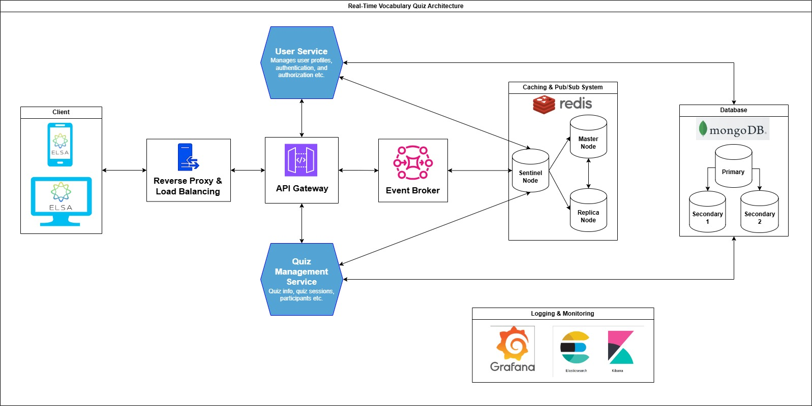

# Welcome to the Real-Time Quiz Coding Challenge!

This repository provides a solution for a real-time quiz feature within an English learning application. Users can join quizzes in real-time, answer questions, and compete with others, seeing their scores reflected instantly on a leaderboard.
For the scope of this project, I have chosen the **Real-Time Leaderboard** feature to design.

Challenge URL: [elsa/coding-challenges](https://github.com/elsa/coding-challenges)

# System Design
## **A. Outline use cases, constraints, and assumptions:**

First of all, I want to clarify the requirements for the **Real-Time Leaderboard** in the Real-Time Vocabulary Quiz Coding Challenge from my perspective, with the following assumptions:

1. This feature will apply to all Elsa users (approximately **40 million** in **100** countries).
2. 20% of users are Daily Active Users (DAU) = **8 million** daily active users (based on my research of similar popular language learning apps like **Duolingo**, which have **15-20%** daily active users).
3. The quiz challenge may last from **10** to **30** minutes.
4. I assume each user participates in **2** quiz sessions per day, resulting in **16** million quiz sessions daily.
5. Assuming 10% of active users are online during peak hours, we estimate **800,000** concurrent users per hour at peak times.
6. If each user submits an answer every 20 seconds, we will have 800,000 / 20 = **40,000** writes per second at peak hours.
7. Assuming a read-to-write ratio of **10:1**, there will be **400,000** read operations per second at peak hours.
8. All participants will start the quiz session at the same time and must finish the quiz within the same time frame.
9. According to constraint #8, there should be a waiting room for users to wait until the session has enough participants, similar to multiplayer games like League of Legends, PUBG, etc.
10. A quiz session will only include users from the same region.
11. The minimum number of participants per session is **5**, and the maximum is **20**.
12. If the waiting room does not reach the minimum number of participants within **3** minutes, the room will be canceled.
13. If the waiting room has enough participants and everyone is ready, the quiz session will start.
14. When a user moves on to the next question, the system will automatically and immediately submit the current question.
15. Users cannot go back to previously answered questions.
16. There will be **3** criteria for calculating the leaderboard: current points, total wrong answers, and answer speed. For example, if 2 users have the same score, the one who answered in less time and with fewer wrong answers will rank higher.
17. After a session closes, all users in that session will be able to view their report, including the time they joined, their score, and their rank.

## **B. High-Level Architecture Overview:**
This system uses microservice architecture with a distributed design to ensure scalability, performance, and reliability. The core components include:

1. Client Layer (Mobile/Web App)
2. API Gateway
3. Quiz Session Management Service
4. Leaderboard Management Service
5. Score Calculation Service
6. Pub/Sub Messaging System
7. Firestore (Database for session data and leaderboard)
8. Monitoring and Logging Tools (Cloud Monitoring, Cloud Logging)

### Architecture Diagram (Main Components):

## Component Descriptions:
### A. Client Layer (Mobile/Web App):
- **Purpose**: The mobile or web app will serve as the interface for users to join quiz sessions, submit answers, and view the leaderboard.
- **Responsibilities**:
   - Allow users to join a waiting room.
   - Display real-time quiz questions and capture answers.
   - Show real-time leaderboard updates after every question.
   - Display the final report and rank at the end of the session.
### B. API Gateway:
- **Purpose**: Central access point for all services.
- **Responsibilities**:
   - Route requests from the client to the appropriate microservices.
   - Handle user authentication, session management, and rate limiting.
- **Service Recommendations**:
   - Use GCP API Gateway for scalable routing, traffic management, and security.

### C. Quiz Session Management Service:
- **Purpose**: Manage the lifecycle of quiz sessions (waiting room, quiz start, progress tracking, and end).
- **Responsibilities**:
   - Create quiz sessions and manage waiting rooms.
   - Track user progress through the quiz.
   - Ensure users within a region join the same session (e.g., EU users join EU sessions).
   - Automatically submit user answers when they move to the next question.
   - Trigger automatic closure of a quiz session when it ends.
- **Data Flow**:
   - Create a quiz session with metadata (region, number of users, questions, start time).
   - On answer submission, forward the answer to the Score Calculation Service and Leaderboard Service.
- **Storage**:
   - Firestore: Store session data (session ID, user IDs, progress, quiz questions).
### D. Score Calculation Service:
- **Purpose**: Calculate points for each user based on their answers, answer time, and accuracy.
- **Responsibilities**:
   - Receive answer submissions from the Quiz Session Management Service.
   - Calculate scores based on correctness, speed, and wrong answers.
   - Send calculated scores to the Leaderboard Management Service.
- **Messaging**:
   - Use Google Cloud Pub/Sub to decouple real-time answer submissions and score calculations.
### E. Leaderboard Management Service:
- **Purpose**: Manage real-time leaderboard updates for each quiz session.
- **Responsibilities**:
   - Store and update the current leaderboard based on user scores.
   - Sort users by points, wrong answers, and speed.
   - Publish leaderboard updates back to clients in real time via Firestore triggers or Pub/Sub.
- **Data Flow**:
   - Firestore: Store leaderboard data for each session in Firestore (e.g., user ID, points, rank, wrong answers, answer speed).
- **Alternative**:
   - If Firestore real-time triggers aren't sufficient for performance, a custom Pub/Sub fanout to deliver updates to clients could be used.
### F. Pub/Sub Messaging System:
- **Purpose**: Decouple services and provide real-time messaging for updates and triggers.
- **Responsibilities**:
   - Send answer submissions from the Quiz Session Management Service to the Score Calculation Service.
   - Broadcast leaderboard updates from the Leaderboard Management Service to clients.
   - Handle user events (quiz start, answer submission, session end) asynchronously.
- **Storage**:
   - Pub/Sub topics for sending updates and calculating scores in real time.
### G. Firestore:
- **Purpose**: Store quiz session and leaderboard data. Firestore is used for its global scale and low-latency access.
- **Responsibilities**:
   - Store quiz session details (session ID, user IDs, quiz progress).
   - Store real-time leaderboard updates.
   - Enable Firestore real-time triggers to broadcast leaderboard updates to users.

## Data Flow
1. **Quiz Session Creation**:
   - Users request to join a quiz via the app.
   - API Gateway routes the request to Quiz Session Management Service.
   - The system checks if the user is already in an active session or if they should join a new waiting room.
2. **Waiting Room**:
   - The Quiz Session Management Service groups users into waiting rooms.
   - Once enough users are in the room and everyone is ready, the quiz session starts.
3. **Quiz Answer Submission**:
   - As users submit answers, the Quiz Session Management Service forwards them via Pub/Sub to the Score Calculation Service.
   - Scores are calculated based on correctness and speed, and the Leaderboard Management Service updates the leaderboard in Firestore.
4. **Real-Time Leaderboard Updates**:
   - The Leaderboard Management Service triggers real-time updates via Firestore triggers or Pub/Sub fanout.
   - Users see live score changes and rankings in the app.
5. **Quiz End and Report**:
   - Once the quiz ends, the final leaderboard is saved in Firestore.
   - Users receive a detailed session report showing their performance (points, rank, wrong answers, answer speed).

Demo Video: [Real-Time Quiz Coding Challenge Demo](https://youtu.be/Xim2UCWSx6A)
