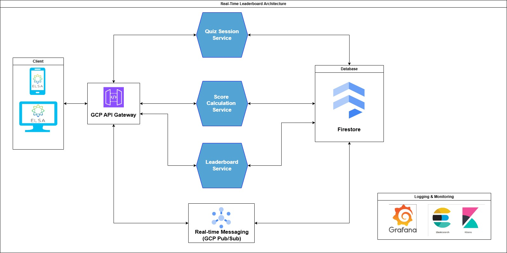
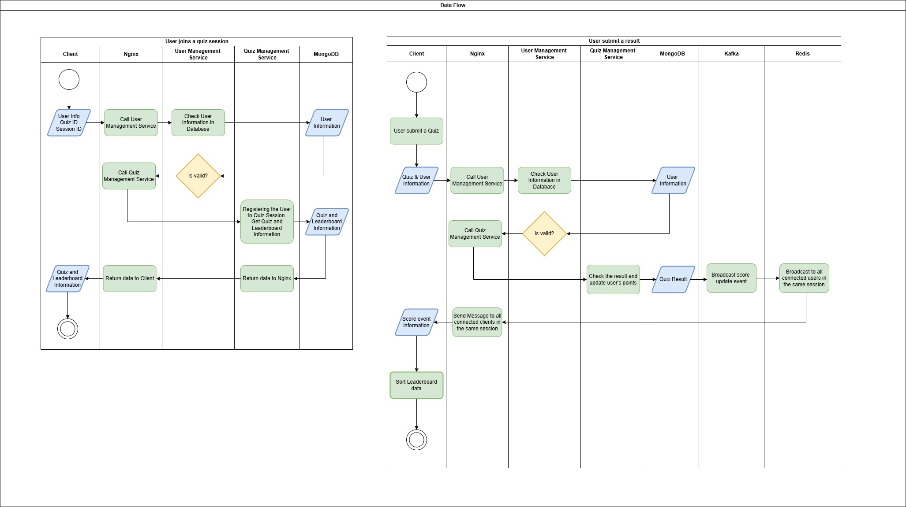

# Welcome to the Real-Time Quiz Coding Challenge!

This repository provides a solution for a real-time quiz feature within an English learning application. Users can join quizzes in real-time, answer questions, and compete with others, seeing their scores reflected instantly on a leaderboard.

Challenge URL: [elsa/coding-challenges](https://github.com/elsa/coding-challenges)

# System Design
## Architecture Diagram:

## Component Descriptions:
1. **Client (Web App and Mobile)**
   - Role: The Client is the front-facing component where users interact with the application. It could be a web app or mobile app and is responsible for presenting the user interface and capturing user input.
2. **Reserved Proxy and Load Balancer**
   - Role: The Reserved Proxy and Load Balancer act as intermediaries between clients and backend services, ensuring efficient distribution of requests and improving the scalability and reliability of the system.
   - Reverse Proxy: It forwards client requests to appropriate backend services while hiding the internal architecture from the client.
   - Load Balancer: Distributes incoming traffic across multiple instances of backend services (e.g., multiple instances of User Service or Quiz Management Service) to avoid overloading a single server and to provide fault tolerance.
3. **API Gateway**
   - Role: The API Gateway is the entry point for all client requests in your microservices architecture. It acts as an intermediary, managing the communication between the clients (Web and Mobile) and the backend services (e.g., User Service, Quiz Management Service, Event Broker). The API Gateway helps streamline request routing, ensures security, provides centralized authentication/authorization, and handles load balancing.
4. **User Service**
   - Role: The User Service handles everything related to user authentication, authorization, and user profile management. It ensures that users can securely log in and access features based on their roles or permissions.
5. **Quiz Management Service**
   - Role: The Quiz Management Service is the core service that handles the entire lifecycle of quizzes. This includes managing quiz information, sessions, participants, and responses.It interacts with the User Service to validate user identities and check if they are allowed to participate in a quiz.
   - Subscribes to the Event Broker for real-time quiz-related updates.
6. **Event Broker**
   - Role: The Event Broker (a messaging service, such as a message queue or pub/sub system) ensures real-time communication between different services. It handles broadcasting updates related to quiz scores and leaderboard rankings.
   - Real-time Event Broadcasting: Handles score updates, leaderboard changes, or notifications related to quiz participation.
   - Message Queue: Stores and forwards messages between services, ensuring that all relevant updates are processed even if some services are temporarily down.
   - Leaderboard Updates: When a user completes a quiz or their score changes, the Event Broker broadcasts this information to services or clients that need to know.
7. **Database**
   - Role: The main persistent database for storing structured and unstructured data, including user information, quizzes, quiz responses, and historical leaderboard data.
8. **Redis** (Caching and Support for Event Broker)
   - Role: Redis is a high-performance in-memory data store primarily used for caching frequently accessed data and supporting the Event Broker with real-time event management.
   - Caching: Used for fast access to frequently queried data (e.g., active quizzes, leaderboard info, user session tokens) to improve performance.
   - Event Broker Support: Redis Pub/Sub can be used for the Event Broker to manage real-time message distribution between services.
   - Session Storage: Temporarily stores user session data (authentication tokens, current session data) for fast retrieval.

## Data Flow

## Technology Justification
1. **Client**: ReactJS (Web) and React Native (Mobile)
   - ReactJS is a popular JavaScript library for building interactive user interfaces on the web.
   - It offers a component-based architecture that simplifies the development of complex UIs.
   - React Native allows us to reuse a significant portion of the codebase for mobile app development (iOS and Android), thus speeding up the development process.
   - My familiarity with JavaScript allows me to maintain and enhance the codebase efficiently, with the added benefit of a large community and a wealth of documentation and resources.
2. **Reverse Proxy and Load Balancer**: Nginx
   - Nginx is a well-established, high-performance HTTP server and reverse proxy that is widely adopted in the industry. It can efficiently handle multiple simultaneous connections with minimal resource usage, making it ideal for high-traffic environments.
   - Nginx also offers SSL termination, static content serving, and load balancing features, which are crucial for distributing traffic across backend services.
3. **API Gateway**: Nginx
   - Nginx is being utilized for its simplicity and ability to act as an API Gateway. It provides request routing, basic security (SSL termination), and integration with the reverse proxy and load balancer.
   - While not as feature-rich as a dedicated API gateway, Nginx simplifies the architecture and operation by consolidating multiple layers into one, reducing operational overhead.
   - This choice may be revisited in the future if the need arises for more API-specific features like rate limiting, JWT validation, or request transformation.
4. **User Service**: Python Django Web API
   - Django is a robust and well-documented web framework in Python, with a built-in admin panel, authentication system, and ORM (Object-Relational Mapping). It allows rapid development of the User Service, managing authentication, authorization, and user profiles.
   - My familiarity with Python and Django ensures efficient development and maintenance of this service.
   - Using Django REST Framework (DRF) ensures that the User Service can expose APIs in a RESTful manner, supporting integration with other services in the system.
5. **Quiz Management Service**: Python Django Web API
   - Django is also a suitable choice for the Quiz Management Service. It allows for the rapid development of RESTful APIs to manage quiz data, participants, and sessions.
   - Django’s scalability, when coupled with a decoupled architecture, ensures that this service can handle increased load as the user base grows. My experience with Django ensures ease of development.
   - Additionally, Django’s ecosystem includes robust third-party packages for integrating MongoDB, allowing flexible schema management and query capabilities.
6. **Event Broker**: Apache Kafka
   - Apache Kafka is the industry standard for distributed event streaming, making it an excellent choice for managing real-time score updates and broadcasting leaderboard changes. It is highly scalable, fault-tolerant, and capable of handling high-throughput events.
   - Kafka’s ability to store events durably ensures reliable message processing, which is critical for real-time systems like leaderboards and quiz scoring.
   - Kafka integrates well with both MongoDB and Redis, enabling smooth communication between services while maintaining data consistency across the system.
7. **Database**: MongoDB (Single Replica Set)
   - MongoDB is a NoSQL database that prioritizes BASE properties (Basically Available, Soft state, Eventual consistency) over strict ACID (Atomicity, Consistency, Isolation, Durability). This is ideal for scenarios where the system performs many read operations, such as fetching quiz information, leaderboard data, and user stats.
   - A single replica set (1 Primary, multiple Secondaries) ensures the system can handle high read loads while maintaining sufficient availability. The secondary nodes handle read traffic, allowing horizontal scaling as read demands grow.
   - MongoDB's flexible schema supports the dynamic nature of quiz data, where quiz structures can vary without rigid table schemas.
8. **Caching and Event Broker Support**: Redis with Sentinel
   - Redis is an in-memory data store known for its speed and simplicity, making it ideal for caching frequently accessed quiz data, leaderboard results, and user session data. This minimizes load on MongoDB and improves the overall system response time.
   - Redis is also used to support real-time Pub/Sub messaging between services, working alongside Kafka for smaller events or real-time leaderboard updates.
   - Redis Sentinel ensures high availability by monitoring Redis nodes and automatically handling failover when necessary. This architecture is reliable and maintains the consistency required for event-driven operations.

Demo Video: [Real-Time Quiz Coding Challenge Demo](https://youtu.be/Xim2UCWSx6A)
